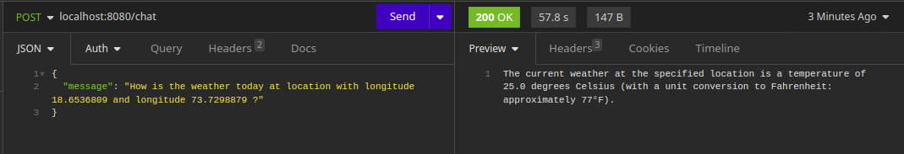

# Implementing Agent with Java

## What is this ?

This is my learning repo.
This reposiroty contains 2 ways to implement AI Agents.
1. Agent with tools
2. Agent with MCP server

There are really good examples for the imaplementation in the spring projects github repo. Link is in the reference.

Note that there are a lot of API calls to the LLM server, and underperforming LLM server can delay the response by a big factor. I've used `llama3.2:1b`, and it took almost 1 min to get the response.

We can expect a response similar to this - 

## Reference
- https://github.com/spring-projects/spring-ai-examples
